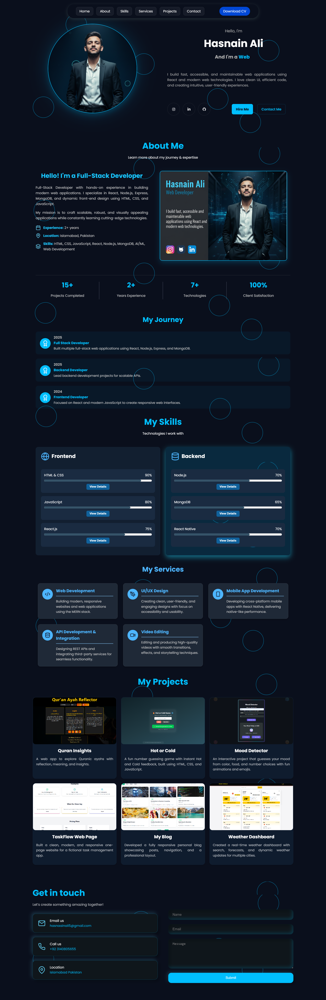

# 🚀  Hasnain Ali | Personal Portfolio Website

A modern and responsive portfolio website built with **React.js**, showcasing my skills, projects, and contact details.  
The site features a **sticky navbar**, **smooth scrolling**, **custom animations**, and a **contact form** with theme-based design.

---

## 🌟 Features
- Sticky Navbar
- Smooth Scrolling to Sections
- Responsive Layout 
- Themed Animations & Floating Background Shapes
- Contact Form with Email Integration
- Downloadable CV Button

---

## 🛠️ Tech Stack
- **React.js** – Frontend
- **CSS3** (Custom variables & animations)
- **React Icons**
- **Netlify / Vercel** (Deployment)

## 📸 Preview
  
*(Add a screenshot of your site here after deployment)*

---

## 🚀 Deployment
This portfolio website is deployed on **GitHub Pages**.  
🔗 **Live Demo:** [https://hasnaainali.github.io/portfolio-website](https://github.com/hasnaainali/portfolio-website)

---

## 📬 Contact
- LinkedIn: [Hasnain Ali](https://www.linkedin.com/in/hasnaainali/)
- GitHub: [Hasnain Ali](https://github.com/hasnaainali)
- Email: hasnaainali5@gmail.com

